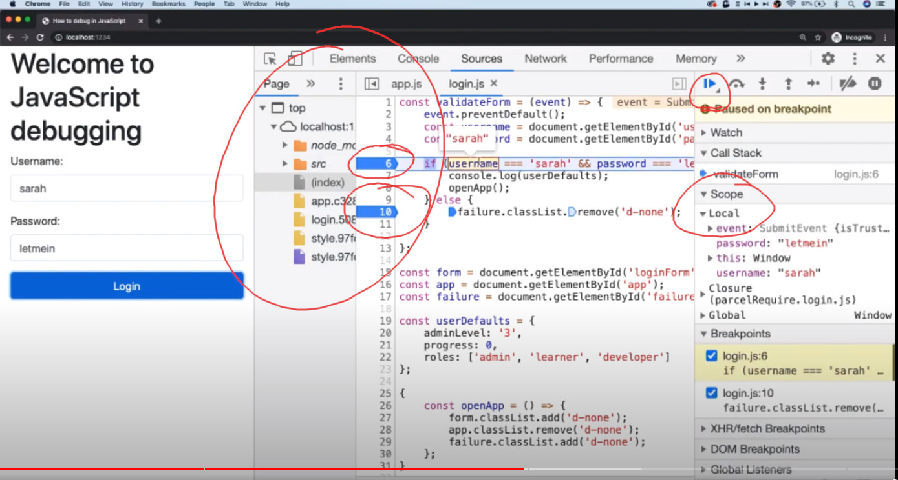

#### for
- you dont want to use this
```js
for (let i=0; i< arry.length; i++) {
  console.log(arry[i])l
}
```

### Higher Order functions and Arrays

#### sample dataset
```js
const arry = [{name: "apple", color: "red", size = 20},{},{}, ...]
const arr = [23,4,234,43,356,7456,8,78]
```

#### forEach
```js

arry.forEach(function(x, index, arry) {
  console.log(x)
});
```

#### filter
```js

const filteredArry = arr.filter(var => (var >= 23)); 
// if arr is a array of dictionaries, you can check condition to any key in the dictionary, use var.key
// you can also put multiple conditions and create conditional statements to multiple keys
```

#### map
```jsx
const mappedArray = arry.map(x => x.name);
```
#### sort
```jsx
const sortedArray = arry.sort( (a,b) => (a.size > b.size ? 1 : -1))
// sort the array arry by the size key
```

#### reduce
```jsx
const sizeSum = arry.reduce ((total, size) => total + size, 0) // second parameter 0, is the initial value of total
```


### Fetch

#### get request
- `fetch('fetch-url')` returns a promise
- `fetch('fetch-url').then(res => console.log(res))` prints the content, but the data is not accessible
- 
  ```js
  fetch('fetch-url')
  .then(res => res.json())
  .then(data=> console.log(data))
  ``` 
  prints the data
- if you want to catch errors
  ```js
  fetch('fetch-url')
  .then(res => res.json())
  .then(data=> console.log(data))
  .catch(error => console.log("Error"))
  ``` 
  however, this doesnot print Error even though there's a 404 error. The fetch was actually successful.
- so actually, what you need to do is
```js
  fetch('fetch-url')
  .then(res => {
    if (res.ok) {
      console.log("Success")
    } else {
      console.log("Not Successful")
    }} )
  .then(data=> console.log(data))
  .catch(error => console.log("Error"))
```

#### post request


### Ternary (conditional) operator
- `condition ? exprIfTrue : exprIfFalse`
- `condition && exprIfTrue`


## Debugging JS in chrome
- sprinkling `console.log` is not efficient

#### inspect elements
- console
- sources
  - contains all the files for running the webpage
  - you can pause the code on certain lines (clicking the line number in the file in sources) and you can see the value of variables at that specific time (in the Local tab)
  - you can resume script execution if the values of variabels are okay



#### open dev tools (`Ctrl + Shift + J`)
-  sources panel
   -  this is where you debug javascript
   -  file navigator pane 
      -  inspect the file that it uses
      -  clicking on the file, you can see the contents of the file
   - javasdript debugging pane
     - event listener breakpoints
       - eg mouse -> click, the script excution stops at the first like code after any mouse click
     - resume script execution `F8`, resumes and continues the execution of script